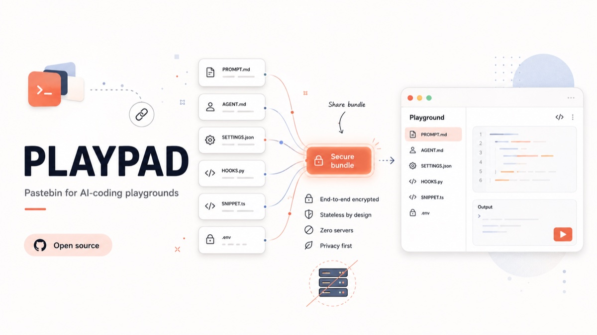

<p align="center">
  
</p>

<h1 align="center">Playpad</h1>

<p align="center">
  <em>Pastebin for AI-coding playgrounds. One link, zero servers.</em>
</p>

<p align="center">
  End-to-end encrypted · Stateless by design · $0 infra · Open source
</p>

---

Playpad lets you bundle the files of an AI-coding playground — prompts, agent
instructions, settings, hooks, snippets — and share them as a single link.
The recipient opens the link and sees the playground. That's it.

## Why

Sharing AI-coding setups today means zipping folders, pasting into Notion,
or hoping a Gist renders right. Playpad is the "throw it over the wall" option —
like pastebin, but built for multi-file playgrounds.

## How it works

Playpad is **stateless**. There is no database, no user accounts, no backend.

The entire playground is compressed and stuffed into the URL fragment (`#…`).
Browsers never send fragments to the server, so the host never sees your content.
Optionally, the bundle is encrypted client-side with a password (PBKDF2-SHA256
→ AES-GCM-256) before it goes into the URL — only someone with the password can
read it.

```
https://playpad.dev/#d=<lz-compressed-json>            # plaintext, public link
https://playpad.dev/#e=<encrypted-blob>                 # password-protected
```

Because it's a static site, hosting is free on Cloudflare Pages, Vercel,
Netlify, or GitHub Pages. Infra cost: $0.

## Features

- **Drag and drop files** straight into the editor, or pick from disk
- **Optional password** — encryption happens entirely in the browser
- **Multi-file** bundles with title and per-file view
- **Mobile-friendly** light UI
- **No tracking, no accounts, no cookies, no DB**

## Limits

URLs aren't infinite. Playpad caps the URL at ~60K chars — modern browsers
handle that fine. Above ~8K, some chat apps and email clients may truncate
the URL, so the editor warns when you cross that line. Roughly translates
to a couple hundred KB of raw text after compression, plenty for prompts,
configs, hooks, and a few snippets. For a full repo, use a Gist.

## Getting started

```bash
npm install
npm run dev
```

Build and preview:

```bash
npm run build
npm run preview
```

## Deploy

Any static host works. The build output is `dist/`.

- **Cloudflare Pages**: connect the repo, build command `npm run build`, output `dist`
- **Vercel**: `vercel --prod`
- **Netlify**: drop-in via `_redirects`
- **GitHub Pages**: push `dist/` to `gh-pages`

## License

MIT
